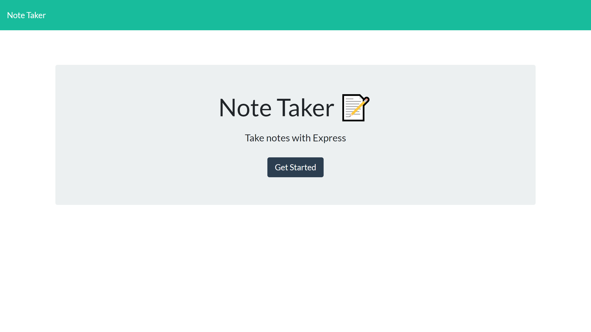
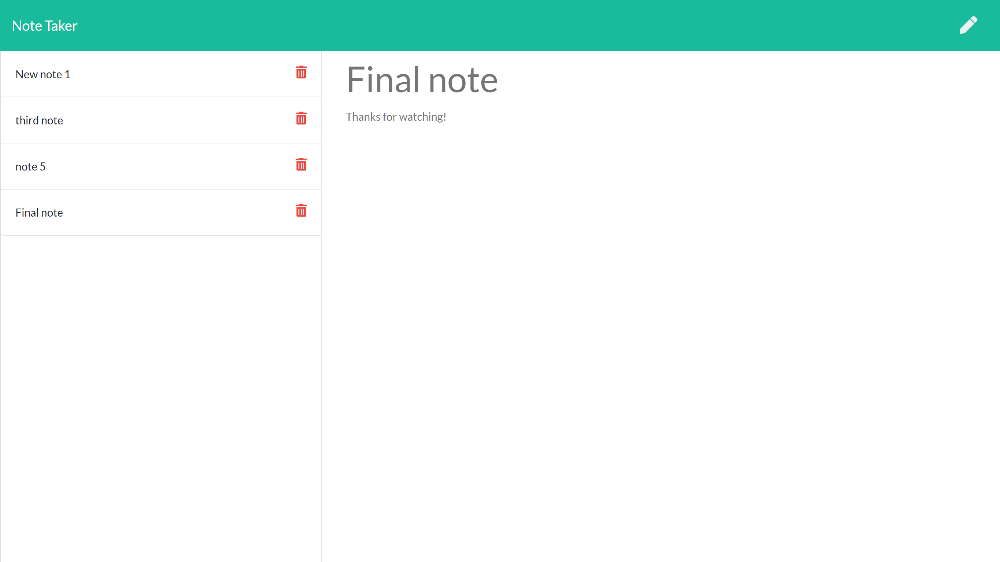

# Express.js Note Taker

This project is an exercise in creating back-end routes and functionality. With this application, the user is able to create notes with a title and body that they can save and later delete. The notes are kept within a JSON object. The back-end technology used are Express.js, Node.js, npm, and UUIDv4. The front-end HTMLs, CSS, and Javascript files were imported from a template.

View the deployed application via Heroku [here](https://stormy-lake-91511.herokuapp.com/)

## Table of Contents
* [Installation](#installation)
* [Usage](#usage)
* [Contributors](#contributors)
* [Questions](#questions)
* [License](#license)

# Installation
Download all the necessary folders and files (db folder, public folder, routes folder, package.json, and server.js). Using your console of choice, run 'npm install' which should download express.js and uuidv4.

# Usage
To start the program, within your console of choice run "node server.js". Now in your browser of choice, go to "localhost:3000".

# Contributors
Thanks to the following people who have contributed to this project:

* [Scott Byer](https://github.com/switch120) 
* [Mike Fearly](https://michaelfearnley.com/)
* UNH Full Stack Development Bootcamp

# Questions
You can find me at my [github page here](https://github.com/ejhuang2015).
Any comments, questions, or concerns? Email me  at ejhuang.2015@gmail.com.

# License
### Copyright (c) [2021] [ejhuang2015]
View the license in [license.txt](./license.txt)